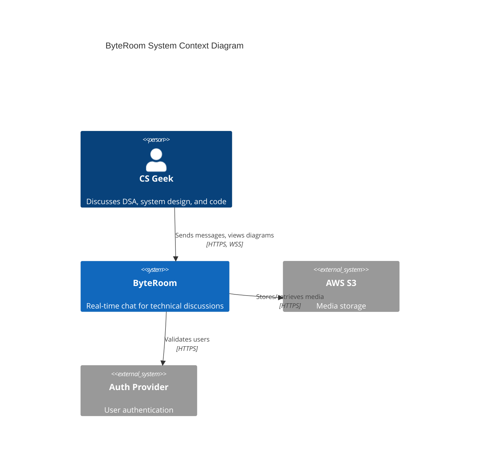
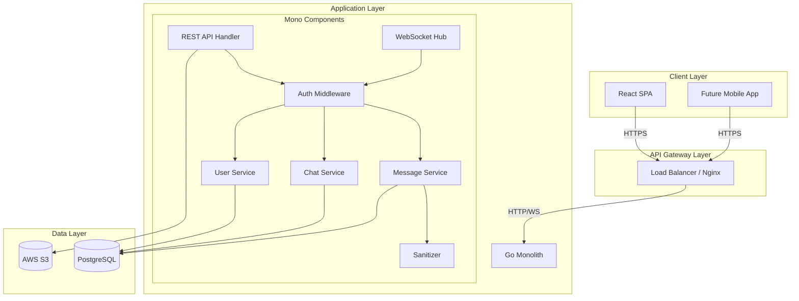
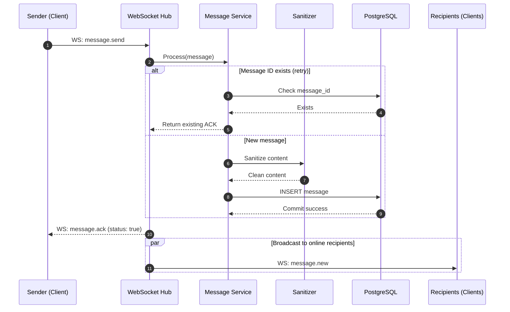
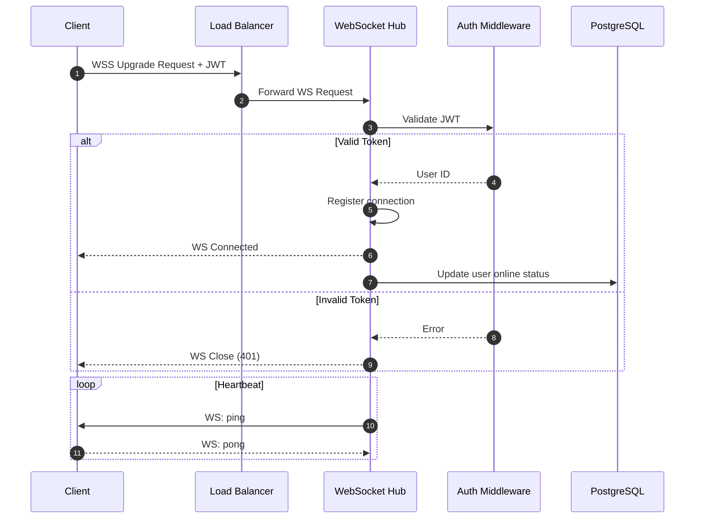
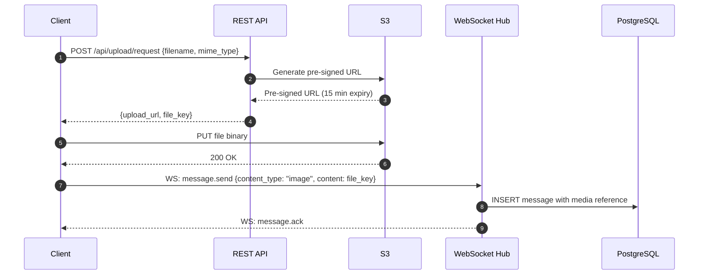
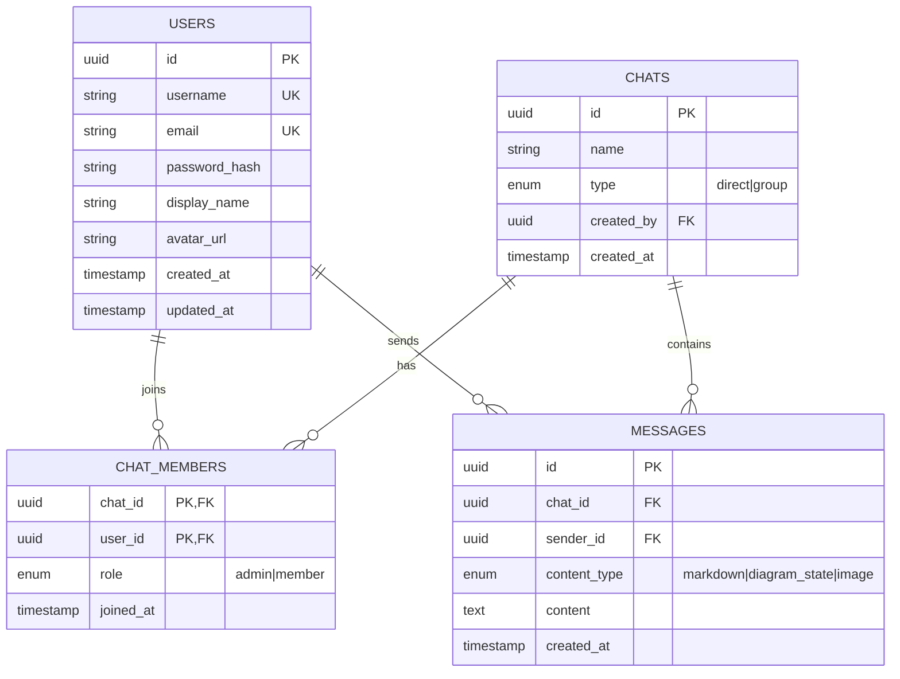
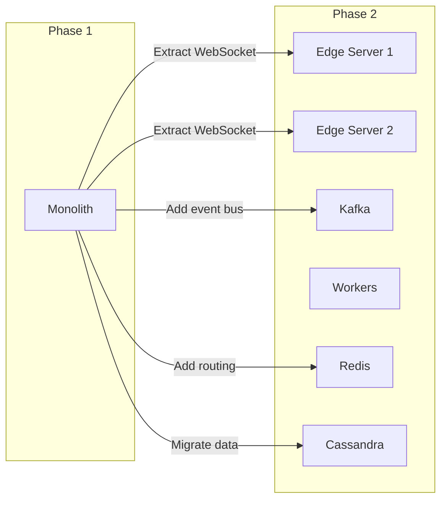
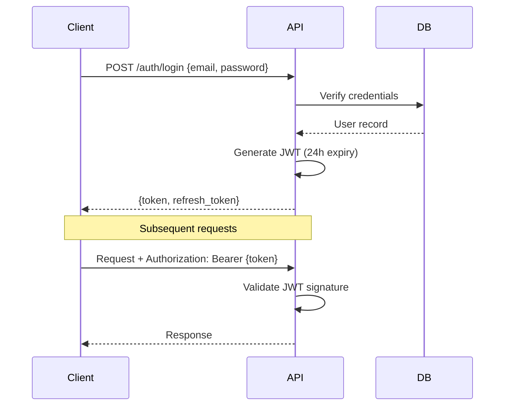
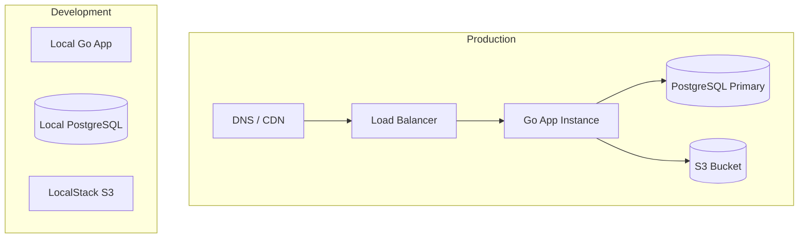

# ByteRoom: High-Level Design (HLD)

## 1. Executive Summary

ByteRoom is a real-time chat platform optimized for technical discussions. This document outlines the high-level architecture for Phase 1 (MVP targeting 100 DAU), with considerations for future scale to 1M DAU.

### Design Goals

| Goal | Target | Rationale |
|------|--------|-----------|
| Latency | < 500ms end-to-end | Real-time conversation feel |
| Durability | Zero message loss | Trust and reliability |
| Availability | 99.9% uptime | Always-on communication |
| Security | XSS-safe content | Code snippets are attack vectors |

## 2. System Context



## 3. High-Level Architecture

### 3.1 Phase 1 Architecture (Monolithic)



### 3.2 Component Responsibilities

| Component | Responsibility |
|-----------|---------------|
| **Load Balancer** | SSL termination, request routing, health checks |
| **REST API Handler** | HTTP endpoints for history, uploads, auth |
| **WebSocket Hub** | Connection management, message routing, broadcasts |
| **Message Service** | Message validation, persistence, idempotency |
| **Chat Service** | Room management, member operations |
| **User Service** | User CRUD, profile management |
| **Auth Middleware** | JWT validation, session management |
| **Sanitizer** | XSS prevention using bluemonday |

## 4. Core Workflows

### 4.1 Message Delivery Flow



### 4.2 User Connection Flow



### 4.3 Media Upload Flow



## 5. Data Architecture

### 5.1 Entity Relationship Diagram



### 5.2 Data Flow Summary

| Data Type | Storage | Access Pattern |
|-----------|---------|----------------|
| User profiles | PostgreSQL | Read-heavy, cached |
| Chat metadata | PostgreSQL | Read-heavy |
| Messages | PostgreSQL | Append-only, time-ordered reads |
| Images/Diagrams | S3 | Write-once, CDN-served reads |
| WebSocket state | In-memory (Hub) | Ephemeral, per-connection |

## 6. Technology Choices

### 6.1 Backend

| Technology | Purpose | Justification |
|------------|---------|---------------|
| **Go 1.22+** | Application server | Excellent concurrency (goroutines), strong stdlib, easy deployment |
| **gorilla/websocket** | WebSocket handling | Battle-tested, full RFC 6455 compliance |
| **PostgreSQL 15** | Primary database | ACID compliance, JSON support, rich indexing |
| **bluemonday** | HTML sanitization | Configurable whitelist-based sanitizer for XSS prevention |

### 6.2 Frontend

| Technology | Purpose | Justification |
|------------|---------|---------------|
| **React 18** | UI framework | Component model, hooks, concurrent features |
| **TypeScript** | Type safety | Catch errors early, better IDE support |
| **Vite** | Build tool | Fast HMR, optimized production builds |
| **Tailwind CSS** | Styling | Utility-first, great dark mode support |
| **Zustand** | State management | Lightweight, TypeScript-first |
| **react-markdown** | Markdown rendering | Safe rendering, plugin ecosystem |
| **react-syntax-highlighter** | Code highlighting | 180+ language support |
| **mermaid** | Diagram rendering | Industry standard for text-to-diagram |
| **@excalidraw/excalidraw** | Interactive diagrams | Collaborative whiteboard |

### 6.3 Infrastructure

| Technology | Purpose | Justification |
|------------|---------|---------------|
| **AWS S3** | Object storage | Scalable, pre-signed URLs for secure uploads |
| **Nginx** | Reverse proxy | WebSocket support, SSL termination |
| **Docker** | Containerization | Consistent environments |

## 7. Scalability Considerations

### 7.1 Phase 1 Limits (100 DAU)

| Metric | Estimate | Within Single Instance |
|--------|----------|----------------------|
| Concurrent WebSockets | ~50 | ✅ Yes |
| Messages/second | ~10 | ✅ Yes |
| Database connections | ~20 | ✅ Yes |
| Storage (monthly) | ~5 GB | ✅ Yes |

### 7.2 Phase 2 Evolution Path



**Key extraction points:**
1. WebSocket Hub → Stateless Edge Servers
2. Message persistence → Kafka (durability) + Cassandra (storage)
3. User routing → Redis (user_id → server mapping)
4. Search → Elasticsearch

## 8. Security Architecture

### 8.1 Authentication Flow



### 8.2 Security Measures

| Threat | Mitigation |
|--------|------------|
| XSS via code blocks | Server-side sanitization with bluemonday |
| Message spoofing | JWT-based authentication, server-assigned sender_id |
| Replay attacks | Message ID idempotency check |
| Unauthorized access | Chat membership validation on all operations |
| Data in transit | TLS/HTTPS for all communications |

## 9. Monitoring & Observability

### 9.1 Key Metrics

| Category | Metrics |
|----------|---------|
| **Latency** | Message delivery time (p50, p95, p99) |
| **Throughput** | Messages/second, WebSocket connections |
| **Errors** | Failed deliveries, sanitization rejections |
| **Saturation** | DB connection pool, memory usage |

### 9.2 Logging Strategy

```
Level   | When to use
--------|------------------------------------------
ERROR   | Failed message persistence, auth failures
WARN    | Reconnection attempts, sanitization blocks
INFO    | User connections, message deliveries
DEBUG   | WebSocket frame details (dev only)
```

## 10. Deployment Architecture



## 11. Future Considerations (Phase 2)

- **Horizontal scaling**: Stateless edge servers with Redis routing
- **Message durability**: Kafka as ingestion buffer before DB writes
- **Search**: Elasticsearch for code snippet and message search
- **Mobile**: React Native or native iOS/Android apps
- **E2E Encryption**: Optional encrypted rooms for sensitive discussions
