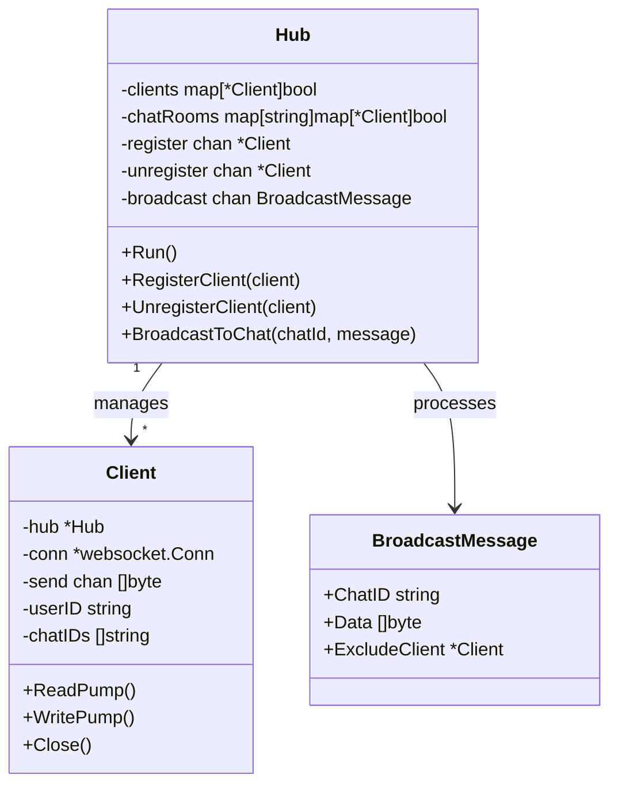
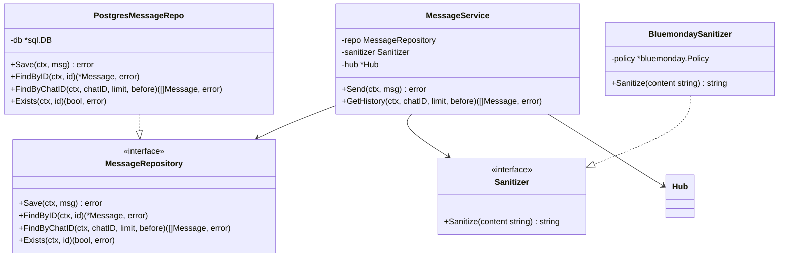
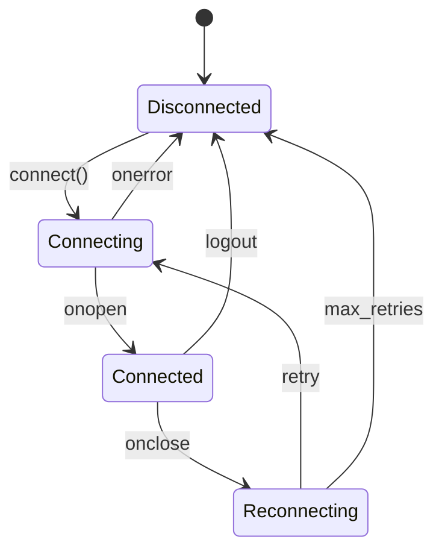

# ByteRoom: Low-Level Design (LLD)

## 1. Overview

This document provides detailed technical specifications for implementing ByteRoom Phase 1. It covers database schemas, API contracts, component internals, and implementation details.

## 2. Database Design

### 2.1 PostgreSQL Schema

```sql
-- Enable UUID extension
CREATE EXTENSION IF NOT EXISTS "uuid-ossp";

-- Users table
CREATE TABLE users (
    id UUID PRIMARY KEY DEFAULT uuid_generate_v4(),
    username VARCHAR(50) UNIQUE NOT NULL,
    email VARCHAR(255) UNIQUE NOT NULL,
    password_hash VARCHAR(255) NOT NULL,
    display_name VARCHAR(100) NOT NULL,
    avatar_url TEXT,
    created_at TIMESTAMPTZ DEFAULT NOW(),
    updated_at TIMESTAMPTZ DEFAULT NOW()
);

CREATE INDEX idx_users_email ON users(email);
CREATE INDEX idx_users_username ON users(username);

-- Chats table
CREATE TABLE chats (
    id UUID PRIMARY KEY DEFAULT uuid_generate_v4(),
    name VARCHAR(100),
    type VARCHAR(10) NOT NULL CHECK (type IN ('direct', 'group')),
    created_by UUID NOT NULL REFERENCES users(id),
    created_at TIMESTAMPTZ DEFAULT NOW()
);

CREATE INDEX idx_chats_created_by ON chats(created_by);

-- Chat members junction table
CREATE TABLE chat_members (
    chat_id UUID NOT NULL REFERENCES chats(id) ON DELETE CASCADE,
    user_id UUID NOT NULL REFERENCES users(id) ON DELETE CASCADE,
    role VARCHAR(10) NOT NULL DEFAULT 'member' CHECK (role IN ('admin', 'member')),
    joined_at TIMESTAMPTZ DEFAULT NOW(),
    PRIMARY KEY (chat_id, user_id)
);

CREATE INDEX idx_chat_members_user ON chat_members(user_id);

-- Messages table (append-only)
CREATE TABLE messages (
    id UUID PRIMARY KEY,  -- Client-generated for idempotency
    chat_id UUID NOT NULL REFERENCES chats(id) ON DELETE CASCADE,
    sender_id UUID NOT NULL REFERENCES users(id),
    content_type VARCHAR(20) NOT NULL CHECK (content_type IN ('markdown', 'diagram_state', 'image')),
    content TEXT NOT NULL,
    created_at TIMESTAMPTZ DEFAULT NOW()
);

-- Composite index for efficient chat history queries
CREATE INDEX idx_messages_chat_time ON messages(chat_id, created_at DESC);
CREATE INDEX idx_messages_sender ON messages(sender_id);

-- Function to update updated_at timestamp
CREATE OR REPLACE FUNCTION update_updated_at()
RETURNS TRIGGER AS $$
BEGIN
    NEW.updated_at = NOW();
    RETURN NEW;
END;
$$ LANGUAGE plpgsql;

CREATE TRIGGER users_updated_at
    BEFORE UPDATE ON users
    FOR EACH ROW
    EXECUTE FUNCTION update_updated_at();
```

### 2.2 Query Patterns

#### Get Chat History (Paginated)

```sql
SELECT m.id, m.sender_id, m.content_type, m.content, m.created_at,
       u.username, u.display_name, u.avatar_url
FROM messages m
JOIN users u ON m.sender_id = u.id
WHERE m.chat_id = $1
ORDER BY m.created_at DESC
LIMIT $2 OFFSET $3;
```

#### Get User's Chats with Last Message

```sql
SELECT c.id, c.name, c.type, c.created_at,
       m.content AS last_message_content,
       m.created_at AS last_message_time,
       u.display_name AS last_message_sender
FROM chats c
JOIN chat_members cm ON c.id = cm.chat_id
LEFT JOIN LATERAL (
    SELECT content, created_at, sender_id
    FROM messages
    WHERE chat_id = c.id
    ORDER BY created_at DESC
    LIMIT 1
) m ON true
LEFT JOIN users u ON m.sender_id = u.id
WHERE cm.user_id = $1
ORDER BY COALESCE(m.created_at, c.created_at) DESC;
```

#### Idempotent Message Insert

```sql
INSERT INTO messages (id, chat_id, sender_id, content_type, content)
VALUES ($1, $2, $3, $4, $5)
ON CONFLICT (id) DO NOTHING
RETURNING *;
```

## 3. API Specifications

### 3.1 REST API Endpoints

#### Authentication

##### POST /api/auth/register

```yaml
Request:
  Content-Type: application/json
  Body:
    username: string (3-50 chars, alphanumeric + underscore)
    email: string (valid email)
    password: string (min 8 chars)
    display_name: string (1-100 chars)

Response 201:
  Body:
    user_id: string (UUID)
    username: string
    email: string
    display_name: string
    token: string (JWT)
    refresh_token: string

Response 400:
  Body:
    error: "validation_error"
    details: [{ field: string, message: string }]

Response 409:
  Body:
    error: "conflict"
    message: "Username or email already exists"
```

##### POST /api/auth/login

```yaml
Request:
  Content-Type: application/json
  Body:
    email: string
    password: string

Response 200:
  Body:
    user_id: string (UUID)
    username: string
    display_name: string
    token: string (JWT, 24h expiry)
    refresh_token: string (7d expiry)

Response 401:
  Body:
    error: "unauthorized"
    message: "Invalid email or password"
```

#### Chats

##### GET /api/chats

```yaml
Headers:
  Authorization: Bearer {token}

Response 200:
  Body:
    chats:
      - chat_id: string
        name: string | null
        type: "direct" | "group"
        members:
          - user_id: string
            username: string
            display_name: string
            avatar_url: string | null
        last_message:
          content: string (truncated to 100 chars)
          sender_name: string
          timestamp: string (ISO 8601)
        created_at: string (ISO 8601)
```

##### POST /api/chats

```yaml
Headers:
  Authorization: Bearer {token}

Request:
  Content-Type: application/json
  Body:
    type: "direct" | "group"
    name: string | null (required for group)
    member_ids: string[] (user UUIDs)

Response 201:
  Body:
    chat_id: string
    name: string | null
    type: string
    members: [{ user_id, username, display_name }]
    created_at: string

Response 400:
  Body:
    error: "validation_error"
    message: "Direct chats must have exactly 2 members"
```

##### GET /api/chats/:chatId/messages

```yaml
Headers:
  Authorization: Bearer {token}

Query Parameters:
  limit: number (default: 50, max: 100)
  before: string (ISO 8601 timestamp, for pagination)

Response 200:
  Body:
    messages:
      - message_id: string
        chat_id: string
        sender_id: string
        sender:
          username: string
          display_name: string
          avatar_url: string | null
        content_type: "markdown" | "diagram_state" | "image"
        content: string
        timestamp: string (ISO 8601)
    has_more: boolean

Response 403:
  Body:
    error: "forbidden"
    message: "You are not a member of this chat"
```

##### POST /api/chats/:chatId/members

```yaml
Headers:
  Authorization: Bearer {token}

Request:
  Body:
    user_ids: string[] (UUIDs to add)

Response 200:
  Body:
    added: string[] (successfully added user IDs)

Response 403:
  Body:
    error: "forbidden"
    message: "Only admins can add members"
```

#### Media Upload

##### POST /api/upload/request

```yaml
Headers:
  Authorization: Bearer {token}

Request:
  Body:
    filename: string
    mime_type: "image/png" | "image/jpeg" | "image/gif" | "image/webp"
    size_bytes: number (max: 10MB)

Response 200:
  Body:
    upload_url: string (pre-signed S3 PUT URL, 15 min expiry)
    file_key: string (S3 key to reference in message)
    expires_at: string (ISO 8601)

Response 400:
  Body:
    error: "validation_error"
    message: "Unsupported file type or size exceeds limit"
```

### 3.2 WebSocket Protocol

#### Connection

```
WSS /ws?token={JWT}
```

#### Message Frame Format

All messages are JSON with the following structure:

```typescript
interface WSFrame {
  event: string;
  data: object;
  request_id?: string;  // Client-provided for request-response correlation
}
```

#### Events: Client → Server

##### message.send

```json
{
  "event": "message.send",
  "request_id": "req_abc123",
  "data": {
    "message_id": "msg_01HQ...",
    "chat_id": "chat_xyz",
    "content_type": "markdown",
    "content": "Hello **world**!\n```python\nprint('hi')\n```"
  }
}
```

##### typing.start

```json
{
  "event": "typing.start",
  "data": {
    "chat_id": "chat_xyz"
  }
}
```

##### typing.stop

```json
{
  "event": "typing.stop",
  "data": {
    "chat_id": "chat_xyz"
  }
}
```

##### ping

```json
{
  "event": "ping",
  "data": {}
}
```

#### Events: Server → Client

##### message.ack

```json
{
  "event": "message.ack",
  "request_id": "req_abc123",
  "data": {
    "message_id": "msg_01HQ...",
    "status": true,
    "timestamp": "2026-03-21T14:40:23Z"
  }
}
```

##### message.error

```json
{
  "event": "message.error",
  "request_id": "req_abc123",
  "data": {
    "message_id": "msg_01HQ...",
    "error": "content_too_large",
    "message": "Message content exceeds 50KB limit"
  }
}
```

##### message.new

```json
{
  "event": "message.new",
  "data": {
    "message_id": "msg_01HQ...",
    "chat_id": "chat_xyz",
    "sender_id": "user_404",
    "sender": {
      "username": "alice",
      "display_name": "Alice Smith",
      "avatar_url": null
    },
    "content_type": "markdown",
    "content": "Hello **world**!",
    "timestamp": "2026-03-21T14:40:23Z"
  }
}
```

##### user.typing

```json
{
  "event": "user.typing",
  "data": {
    "chat_id": "chat_xyz",
    "user_id": "user_404",
    "username": "alice",
    "is_typing": true
  }
}
```

##### pong

```json
{
  "event": "pong",
  "data": {}
}
```

##### error

```json
{
  "event": "error",
  "data": {
    "code": "unauthorized",
    "message": "Token expired"
  }
}
```

## 4. Component Designs

### 4.1 WebSocket Hub



#### Hub Implementation Pseudocode

```go
type Hub struct {
    clients    map[*Client]bool
    chatRooms  map[string]map[*Client]bool
    register   chan *Client
    unregister chan *Client
    broadcast  chan *BroadcastMessage
    mu         sync.RWMutex
}

func (h *Hub) Run() {
    for {
        select {
        case client := <-h.register:
            h.mu.Lock()
            h.clients[client] = true
            for _, chatID := range client.chatIDs {
                if h.chatRooms[chatID] == nil {
                    h.chatRooms[chatID] = make(map[*Client]bool)
                }
                h.chatRooms[chatID][client] = true
            }
            h.mu.Unlock()

        case client := <-h.unregister:
            h.mu.Lock()
            if _, ok := h.clients[client]; ok {
                delete(h.clients, client)
                for _, chatID := range client.chatIDs {
                    delete(h.chatRooms[chatID], client)
                }
                close(client.send)
            }
            h.mu.Unlock()

        case msg := <-h.broadcast:
            h.mu.RLock()
            if clients, ok := h.chatRooms[msg.ChatID]; ok {
                for client := range clients {
                    if client != msg.ExcludeClient {
                        select {
                        case client.send <- msg.Data:
                        default:
                            // Client buffer full, schedule disconnect
                            go h.UnregisterClient(client)
                        }
                    }
                }
            }
            h.mu.RUnlock()
        }
    }
}
```

### 4.2 Message Service



#### Message Send Flow

```go
func (s *MessageService) Send(ctx context.Context, msg *Message) error {
    // 1. Validate
    if err := s.validate(msg); err != nil {
        return fmt.Errorf("validation: %w", err)
    }

    // 2. Check membership
    isMember, err := s.chatRepo.IsMember(ctx, msg.ChatID, msg.SenderID)
    if err != nil {
        return fmt.Errorf("checking membership: %w", err)
    }
    if !isMember {
        return ErrNotChatMember
    }

    // 3. Idempotency check
    exists, err := s.repo.Exists(ctx, msg.ID)
    if err != nil {
        return fmt.Errorf("checking existence: %w", err)
    }
    if exists {
        // Already processed, return success (idempotent)
        return nil
    }

    // 4. Sanitize content
    if msg.ContentType == "markdown" {
        msg.Content = s.sanitizer.Sanitize(msg.Content)
    }

    // 5. Persist
    if err := s.repo.Save(ctx, msg); err != nil {
        return fmt.Errorf("saving message: %w", err)
    }

    // 6. Broadcast to chat room
    broadcastData, _ := json.Marshal(WSFrame{
        Event: "message.new",
        Data:  msg.ToWireFormat(),
    })
    s.hub.BroadcastToChat(msg.ChatID, broadcastData, msg.SenderID)

    return nil
}
```

### 4.3 XSS Sanitizer Configuration

```go
func NewSanitizer() *BluemondaySanitizer {
    p := bluemonday.UGCPolicy()
    
    // Allow common markdown elements
    p.AllowElements("p", "br", "hr")
    p.AllowElements("h1", "h2", "h3", "h4", "h5", "h6")
    p.AllowElements("ul", "ol", "li")
    p.AllowElements("blockquote", "pre", "code")
    p.AllowElements("strong", "em", "del", "s")
    p.AllowElements("a")
    p.AllowAttrs("href").OnElements("a")
    p.RequireParseableURLs(true)
    p.AllowRelativeURLs(false)
    p.AllowURLSchemes("http", "https")
    
    // Allow code block attributes for syntax highlighting
    p.AllowAttrs("class").Matching(regexp.MustCompile(`^language-[a-zA-Z0-9]+$`)).OnElements("code")
    
    // Block dangerous elements
    p.AllowElements()  // This resets, but we added what we need above
    
    return &BluemondaySanitizer{policy: p}
}
```

## 5. Frontend Architecture Details

### 5.1 State Management



### 5.2 Zustand Store Structure

```typescript
// stores/chatStore.ts
interface Message {
  message_id: string;
  chat_id: string;
  sender_id: string;
  sender: {
    username: string;
    display_name: string;
    avatar_url: string | null;
  };
  content_type: 'markdown' | 'diagram_state' | 'image';
  content: string;
  timestamp: string;
  status: 'pending' | 'sent' | 'error';
}

interface Chat {
  chat_id: string;
  name: string | null;
  type: 'direct' | 'group';
  members: User[];
  last_message: Message | null;
}

interface ChatState {
  chats: Record<string, Chat>;
  messages: Record<string, Message[]>;  // chatId -> messages
  activeChat: string | null;
  typingUsers: Record<string, string[]>;  // chatId -> userIds
}

interface ChatActions {
  setActiveChat: (chatId: string) => void;
  addChat: (chat: Chat) => void;
  addMessage: (chatId: string, message: Message) => void;
  addOptimisticMessage: (chatId: string, message: Message) => void;
  confirmMessage: (chatId: string, tempId: string, serverMessage: Message) => void;
  failMessage: (chatId: string, tempId: string) => void;
  setTyping: (chatId: string, userId: string, isTyping: boolean) => void;
  loadMessages: (chatId: string, messages: Message[]) => void;
}
```

### 5.3 WebSocket Hook

```typescript
// hooks/useWebSocket.ts
interface UseWebSocketOptions {
  url: string;
  token: string;
  onMessage: (event: WSEvent) => void;
  onConnect?: () => void;
  onDisconnect?: () => void;
}

interface UseWebSocketReturn {
  send: (event: string, data: object) => void;
  connectionState: 'connected' | 'connecting' | 'disconnected' | 'reconnecting';
}

export function useWebSocket(options: UseWebSocketOptions): UseWebSocketReturn {
  const wsRef = useRef<WebSocket | null>(null);
  const reconnectAttempts = useRef(0);
  const maxReconnectAttempts = 5;
  const [connectionState, setConnectionState] = useState<ConnectionState>('disconnected');

  const connect = useCallback(() => {
    setConnectionState('connecting');
    const ws = new WebSocket(`${options.url}?token=${options.token}`);

    ws.onopen = () => {
      setConnectionState('connected');
      reconnectAttempts.current = 0;
      options.onConnect?.();
    };

    ws.onmessage = (event) => {
      const data = JSON.parse(event.data);
      options.onMessage(data);
    };

    ws.onclose = () => {
      if (reconnectAttempts.current < maxReconnectAttempts) {
        setConnectionState('reconnecting');
        const delay = Math.min(1000 * Math.pow(2, reconnectAttempts.current), 30000);
        setTimeout(() => {
          reconnectAttempts.current++;
          connect();
        }, delay);
      } else {
        setConnectionState('disconnected');
        options.onDisconnect?.();
      }
    };

    wsRef.current = ws;
  }, [options]);

  const send = useCallback((event: string, data: object) => {
    if (wsRef.current?.readyState === WebSocket.OPEN) {
      wsRef.current.send(JSON.stringify({ event, data }));
    }
  }, []);

  useEffect(() => {
    connect();
    return () => wsRef.current?.close();
  }, [connect]);

  return { send, connectionState };
}
```

### 5.4 Message Rendering Pipeline

```mermaid
flowchart TD
    A[Raw Message Content] --> B{Content Type?}
    B -->|markdown| C[react-markdown]
    B -->|diagram_state| D[Parse JSON]
    B -->|image| E[Image Component]
    
    C --> F{Contains code block?}
    F -->|Yes| G{Is mermaid?}
    F -->|No| H[Render as text]
    
    G -->|Yes| I[mermaid.render]
    G -->|No| J[react-syntax-highlighter]
    
    I --> K[SVG Output]
    J --> L[Highlighted Code]
    
    D --> M[@excalidraw/excalidraw]
    M --> N[Interactive Canvas]
    
    E --> O[Lazy Load Image]
    O --> P[Rendered Image]
```

### 5.5 Component Hierarchy

```
App
├── AuthProvider
│   └── Routes
│       ├── LoginPage
│       │   └── LoginForm
│       └── ProtectedRoute
│           └── ChatLayout
│               ├── Sidebar
│               │   ├── UserProfile
│               │   ├── ChatList
│               │   │   └── ChatListItem
│               │   └── NewChatButton
│               └── ChatView
│                   ├── ChatHeader
│                   │   ├── ChatTitle
│                   │   └── MemberAvatars
│                   ├── MessageList
│                   │   └── MessageBubble
│                   │       ├── MarkdownRenderer
│                   │       │   ├── CodeBlock
│                   │       │   └── MermaidDiagram
│                   │       ├── ExcalidrawEmbed
│                   │       └── ImageAttachment
│                   ├── TypingIndicator
│                   └── MessageInput
│                       ├── TextArea
│                       ├── AttachmentButton
│                       └── SendButton
```

## 6. Error Handling

### 6.1 Backend Error Types

```go
// domain/errors.go
var (
    ErrNotFound       = errors.New("resource not found")
    ErrUnauthorized   = errors.New("unauthorized")
    ErrForbidden      = errors.New("forbidden")
    ErrValidation     = errors.New("validation error")
    ErrDuplicate      = errors.New("duplicate resource")
    ErrContentTooLarge = errors.New("content too large")
)

type ValidationError struct {
    Field   string `json:"field"`
    Message string `json:"message"`
}

type APIError struct {
    Code    string            `json:"error"`
    Message string            `json:"message"`
    Details []ValidationError `json:"details,omitempty"`
}
```

### 6.2 HTTP Error Responses

| Error | HTTP Status | Response |
|-------|-------------|----------|
| ErrNotFound | 404 | `{"error": "not_found", "message": "..."}` |
| ErrUnauthorized | 401 | `{"error": "unauthorized", "message": "..."}` |
| ErrForbidden | 403 | `{"error": "forbidden", "message": "..."}` |
| ErrValidation | 400 | `{"error": "validation_error", "details": [...]}` |
| ErrDuplicate | 409 | `{"error": "conflict", "message": "..."}` |
| Internal | 500 | `{"error": "internal_error", "message": "An error occurred"}` |

### 6.3 Frontend Error Handling

```typescript
// services/api.ts
class APIError extends Error {
  constructor(
    public status: number,
    public code: string,
    message: string,
    public details?: ValidationError[]
  ) {
    super(message);
  }
}

async function handleResponse<T>(response: Response): Promise<T> {
  if (!response.ok) {
    const error = await response.json();
    throw new APIError(response.status, error.error, error.message, error.details);
  }
  return response.json();
}
```

## 7. Configuration

### 7.1 Backend Configuration

```go
// config/config.go
type Config struct {
    Server   ServerConfig
    Database DatabaseConfig
    JWT      JWTConfig
    S3       S3Config
}

type ServerConfig struct {
    Port            int           `env:"PORT" envDefault:"8080"`
    ReadTimeout     time.Duration `env:"READ_TIMEOUT" envDefault:"15s"`
    WriteTimeout    time.Duration `env:"WRITE_TIMEOUT" envDefault:"15s"`
    ShutdownTimeout time.Duration `env:"SHUTDOWN_TIMEOUT" envDefault:"30s"`
}

type DatabaseConfig struct {
    Host         string `env:"DB_HOST" envDefault:"localhost"`
    Port         int    `env:"DB_PORT" envDefault:"5432"`
    User         string `env:"DB_USER,required"`
    Password     string `env:"DB_PASSWORD,required"`
    Name         string `env:"DB_NAME" envDefault:"byteroom"`
    SSLMode      string `env:"DB_SSLMODE" envDefault:"disable"`
    MaxOpenConns int    `env:"DB_MAX_OPEN_CONNS" envDefault:"25"`
    MaxIdleConns int    `env:"DB_MAX_IDLE_CONNS" envDefault:"5"`
}

type JWTConfig struct {
    Secret         string        `env:"JWT_SECRET,required"`
    AccessExpiry   time.Duration `env:"JWT_ACCESS_EXPIRY" envDefault:"24h"`
    RefreshExpiry  time.Duration `env:"JWT_REFRESH_EXPIRY" envDefault:"168h"`
}

type S3Config struct {
    Bucket          string `env:"S3_BUCKET,required"`
    Region          string `env:"S3_REGION" envDefault:"us-east-1"`
    PresignedExpiry time.Duration `env:"S3_PRESIGNED_EXPIRY" envDefault:"15m"`
}
```

### 7.2 Environment Variables

```bash
# .env.example
PORT=8080
DB_HOST=localhost
DB_PORT=5432
DB_USER=byteroom
DB_PASSWORD=secret
DB_NAME=byteroom
DB_SSLMODE=disable
JWT_SECRET=your-256-bit-secret-key-here
S3_BUCKET=byteroom-uploads
S3_REGION=us-east-1
```

## 8. Testing Strategy

### 8.1 Test Categories

| Category | Scope | Tools | Example |
|----------|-------|-------|---------|
| Unit | Single function/method | Go testing, Vitest | `TestSanitizer_Sanitize_RemovesScriptTags` |
| Integration | Component + dependencies | testcontainers | `TestMessageRepo_Save_PersistsToPostgres` |
| API | HTTP endpoints | httptest | `TestHandler_GetHistory_ReturnsPaginatedMessages` |
| WebSocket | WS protocol | gorilla/websocket test | `TestHub_Broadcast_DeliversToAllClients` |
| E2E | Full user flow | Playwright | `test_user_can_send_and_receive_message` |

### 8.2 Test Data Factories

```go
// testutil/factory.go
func NewTestUser(opts ...UserOption) *User {
    u := &User{
        ID:          uuid.New().String(),
        Username:    "testuser_" + randomString(6),
        Email:       randomString(8) + "@test.com",
        DisplayName: "Test User",
    }
    for _, opt := range opts {
        opt(u)
    }
    return u
}

func NewTestMessage(opts ...MessageOption) *Message {
    m := &Message{
        ID:          uuid.New().String(),
        ChatID:      uuid.New().String(),
        SenderID:    uuid.New().String(),
        ContentType: "markdown",
        Content:     "Test message content",
        CreatedAt:   time.Now(),
    }
    for _, opt := range opts {
        opt(m)
    }
    return m
}
```

## 9. Performance Considerations

### 9.1 Database Optimization

- **Connection pooling**: Max 25 open connections for Phase 1
- **Prepared statements**: Pre-compile frequent queries
- **Indexes**: Composite index on `(chat_id, created_at DESC)` for message retrieval

### 9.2 WebSocket Optimization

- **Buffer sizes**: 4KB read/write buffers per connection
- **Ping interval**: 30 seconds
- **Pong timeout**: 60 seconds
- **Message size limit**: 64KB

### 9.3 Frontend Optimization

- **Code splitting**: Lazy load Mermaid and Excalidraw
- **Virtualization**: Use `react-window` for long message lists
- **Image optimization**: Lazy load images below fold
- **IndexedDB**: Cache recent messages for offline access
