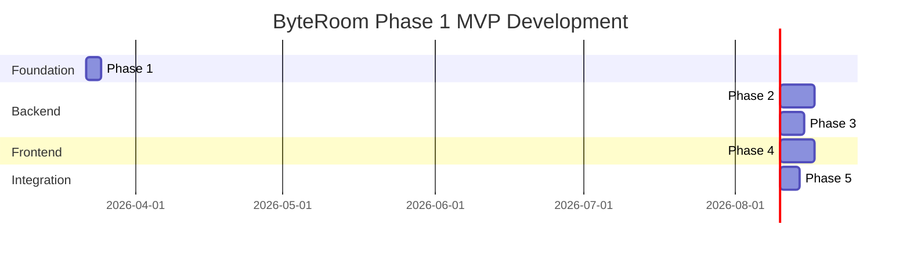

# ByteRoom: Execution Phases Overview

## Development Methodology

This project follows **Test-Driven Development (TDD)** with measurable, testable milestones. Each phase has:

- **Subtasks**: Granular, implementable work items
- **Exit Criteria**: Measurable conditions that must be met
- **Test Requirements**: Specific tests that must pass
- **Deliverables**: Concrete outputs

## Phase Summary



## Phases

| Phase | Name | Focus Area | Dependencies |
|-------|------|------------|--------------|
| [Phase 1](./phase-1-foundation.md) | Foundation & Setup | Project scaffolding, CI/CD, dev environment | None |
| [Phase 2](./phase-2-backend-core.md) | Backend Core | REST API, database, auth, services | Phase 1 |
| [Phase 3](./phase-3-websocket.md) | WebSocket & Realtime | Hub, client handling, message routing | Phase 2 |
| [Phase 4](./phase-4-frontend.md) | Frontend | React app, components, state management | Phase 2 |
| [Phase 5](./phase-5-integration.md) | Integration & Polish | E2E testing, deployment, documentation | Phases 3, 4 |

## Progress Tracking

### Overall Completion

```
Phase 1: Foundation     [ ] 0/6 tasks
Phase 2: Backend Core   [ ] 0/12 tasks
Phase 3: WebSocket      [ ] 0/8 tasks
Phase 4: Frontend       [ ] 0/14 tasks
Phase 5: Integration    [ ] 0/8 tasks
─────────────────────────────────────
Total:                  [ ] 0/48 tasks
```

## Quality Gates

Before moving to the next phase, ALL exit criteria must be met:

### Automated Checks
- [ ] All unit tests pass
- [ ] All integration tests pass
- [ ] Code coverage ≥ 80%
- [ ] No critical linting errors
- [ ] No security vulnerabilities (dependency scan)

### Manual Checks
- [ ] Code review completed
- [ ] Documentation updated
- [ ] Demo to stakeholder (if applicable)

## Test Pyramid

```
        ╱╲
       ╱E2E╲         10% - Critical user journeys
      ╱──────╲
     ╱Integration╲   20% - API, DB, WebSocket
    ╱──────────────╲
   ╱   Unit Tests   ╲ 70% - Functions, components
  ╱──────────────────╲
```

## Getting Started

1. **Read Phase 1** to set up development environment
2. **Follow TDD cycle** for each task:
   - Write failing test
   - Implement minimal code to pass
   - Refactor
3. **Mark tasks complete** in phase documents
4. **Verify exit criteria** before proceeding

## Conventions

### Task Status

- `[ ]` - Not started
- `[~]` - In progress
- `[x]` - Completed
- `[-]` - Blocked/Skipped

### Commit Message Format

```
<type>(<phase>-<task>): <description>

Examples:
feat(p2-t3): implement message service with idempotency
test(p3-t2): add websocket hub broadcast tests
fix(p4-t5): resolve mermaid rendering race condition
```
